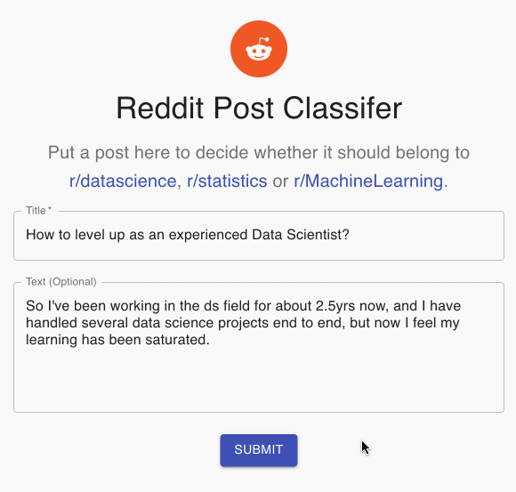

# Reddit Post Classification

[](https://github.com/psf/black)
[](https://github.com/kingyiusuen/reddit-post-classification/blob/master/.pre-commit-config.yaml)

[](https://github.com/kingyiusuen/reddit-post-classification/blob/master/LICENSE)

It can be tricky to find the right subreddit to submit your post when your post is about statistics, machine learning and data science, as there is a great deal of overlap between them.

In this project, I scraped a total of around 1,500 posts from [r/MachineLearning](https:/www.reddit.com/r/MachineLearning) and [r/LearningMachineLearning](https://www.reddit.com/r/learnmachinelearning), trained a classifer to predict the subreddit of the posts, and built a data product that suggests which subreddit you should post to.



## Results

## Quick Start

Clone the repositiory, create a virtual envrionment, and install dependencies.

```
git clone https://github.com/kingyiusuen/reddit-post-classification.git
make venv
```

### Build Docker image

Build Docker image for AWS Lambda.

```
docker build --tag reddit-post-classifier --file backend/Dockerfile .
```

Run the Docker image as a container.

```
docker run -p 9000:8080 -it --rm reddit-post-classifier
```

Test the container with a POST request.

```
curl -XPOST "http://localhost:9000/2015-03-31/functions/function/invocations" -d '{"text": "I love machine learning"}'
```

## Frontend

Start the frontend server.

```
cd frontend
npm start
```
